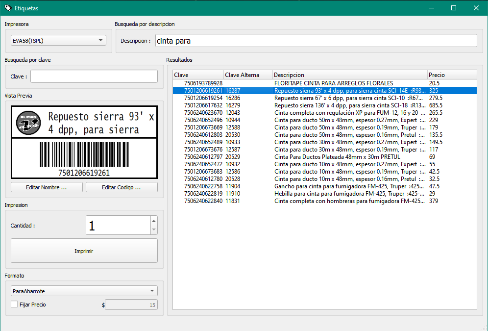

# LabelPrinter

LabelPrinter es una aplicación diseñada para imprimir etiquetas para productos con código de barras codificado en Code128. La aplicación permite:

- Crear múltiples formatos de etiquetas personalizadas, que incluyen:
  - Inclusión de un logo.
  - Adición de líneas horizontales para separar secciones en la etiqueta.
  - Generación de código de barras en Code128 de la clave de producto adaptado para ser lo más grande posible para facilitar la lectura con un lector de código de barras estándar.
  - Inclusión de texto del código clave y código de clave alterna.
  - Descripcion del producto.
  - Precio del producto.
- Conexión con un usuario de consulta a SICAR para obtener información actualizada de los productos.
- Impresión de etiquetas en impresoras térmicas de etiquetas de tamaño 25mmx50mm.
- Búsqueda por clave directa en la base de datos de productos de SICAR.

## Requisitos

- Qt 5.15.2
- MySQL
- MinGW 8.1.0
- Impresora térmica de etiquetas de 25mmx50mm

## Instalación

1. Clona este repositorio en tu máquina local.
2. Realiza la instalación de Qt 5.15.2 y MySQL en tu sistema.
3. Compila el proyecto abriendo el archivo `.pro` y ejecutándolo.
4. Si no deseas compilar desde el código fuente, ejecuta `windeployqt` en el archivo `Etiquetas.exe` ubicado en la ruta `doc/bin/` del repositorio.
5. Instala MinGW 8.1.0 en tu sistema.
6. Modifica el archivo `ip_server.txt` para configurar la IP del servidor donde se encuentra la base de datos de SICAR. Además, asegúrate de ingresar el usuario y la contraseña de SQL con permisos de consulta.

## Uso

Una vez instalado y configurado, ejecuta `Etiquetas.exe` para abrir la aplicación.

## Contribuciones y Uso del Codigo

Este proyecto se ofrece como un recurso abierto para la comunidad, destinado a servir como ejemplo de integración con SICAR Punto de Venta. Si bien puedes utilizar este código como base para adaptarlo a tus propias necesidades comerciales y realizar modificaciones para tu negocio, te animamos a hacerlo de manera responsable.

Valoramos y apoyamos la creatividad y la innovación en la adaptación de este código a diferentes contextos empresariales. Si decides hacer ajustes o mejoras, te sugerimos hacer un fork del repositorio y trabajar en tu propia versión del código.

## Licencia

Este proyecto está bajo la Licencia MIT.
